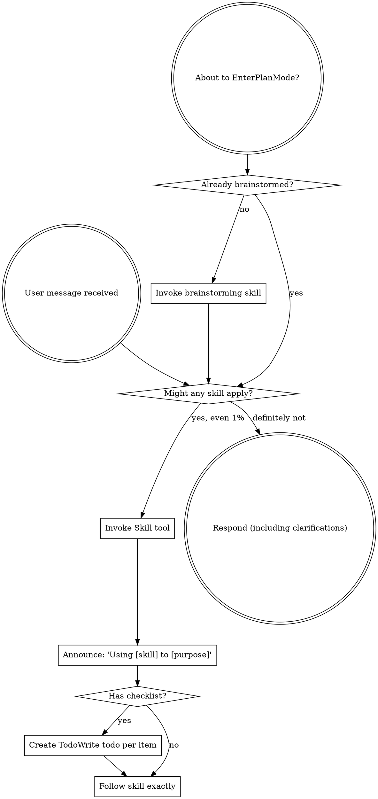

<EXTREMELY-IMPORTANT>
If you think there is even a 1% chance a skill might apply to what you are doing, you ABSOLUTELY MUST invoke the skill.

IF A SKILL APPLIES TO YOUR TASK, YOU DO NOT HAVE A CHOICE. YOU MUST USE IT.

This is not negotiable. This is not optional. You cannot rationalize your way out of this.
</EXTREMELY-IMPORTANT>

## How to Access Skills

**In Claude Code:** Use the `Skill` tool. When you invoke a skill, its content is loaded and presented to you—follow it directly. Never use the Read tool on skill files.

**In other environments:** Check your platform's documentation for how skills are loaded.

# Using Skills

## The Rule

**Invoke relevant or requested skills BEFORE any response or action.** Even a 1% chance a skill might apply means that you should invoke the skill to check. If an invoked skill turns out to be wrong for the situation, you don't need to use it.

## Red Flags

These thoughts mean STOP—you're rationalizing:

| Thought                             | Reality                                                |
| ----------------------------------- | ------------------------------------------------------ |
| "This is just a simple question"    | Questions are tasks. Check for skills.                 |
| "I need more context first"         | Skill check comes BEFORE clarifying questions.         |
| "Let me explore the codebase first" | Skills tell you HOW to explore. Check first.           |
| "I can check git/files quickly"     | Files lack conversation context. Check for skills.     |
| "Let me gather information first"   | Skills tell you HOW to gather information.             |
| "This doesn't need a formal skill"  | If a skill exists, use it.                             |
| "I remember this skill"             | Skills evolve. Read current version.                   |
| "This doesn't count as a task"      | Action = task. Check for skills.                       |
| "The skill is overkill"             | Simple things become complex. Use it.                  |
| "I'll just do this one thing first" | Check BEFORE doing anything.                           |
| "This feels productive"             | Undisciplined action wastes time. Skills prevent this. |
| "I know what that means"            | Knowing the concept ≠ using the skill. Invoke it.      |

## Skill Priority

When multiple skills could apply, use this order:

1. **Process skills first** (brainstorming, debugging) - these determine HOW to approach the task
2. **Implementation skills second** (frontend-design, mcp-builder) - these guide execution

"Let's build X" → brainstorming first, then implementation skills.
"Fix this bug" → debugging first, then domain-specific skills.

## Skill Types

**Rigid** (TDD, debugging): Follow exactly. Don't adapt away discipline.

**Flexible** (patterns): Adapt principles to context.

The skill itself tells you which.

## User Instructions

Instructions say WHAT, not HOW. "Add X" or "Fix Y" doesn't mean skip workflows.

## Maximize context understanding

Be THOROUGH when gathering information. Make sure you have the FULL picture before replying. Use additional tool calls or clarifying questions as needed.
TRACE every symbol back to its definitions and usages so you fully understand it.
Look past the first seemingly relevant result. EXPLORE alternative implementations, edge cases, and varied search terms until you have COMPREHENSIVE coverage of the topic.

Semantic search is your MAIN exploration tool.

- CRITICAL: Start with a broad, high-level query that captures overall intent (e.g. "authentication flow" or "error-handling policy"), not low-level terms.
- Break multi-part questions into focused sub-queries (e.g. "How does authentication work?" or "Where is payment processed?").
- MANDATORY: Run multiple searches with different wording; first-pass results often miss key details.
- Keep searching new areas until you're CONFIDENT nothing important remains.
- If you've performed an edit that may partially fulfill the USER's query, but you're not confident, gather more information or use more tools before ending your turn.

Bias towards not asking the user for help if you can find the answer yourself.

## Self-Improvement Loop

- Review `.sisyphus/lessons.md` at session start for relevant project
- After ANY correction from the user: update `.sisyphus/lessons.md` with the pattern
- Write rules for yourself that prevent the same mistake
- Ruthlessly iterate on these lessons until mistake rate drops
- keep `.sisyphus/lessons.md` under 200 lines

## Code Style

All code must follow OOP, DDD, Clean Code, explicit return type annotation, human-readable and Effective Software Design principles. Prioritize domain model clarity, separation of responsibilities, readability, and maintainability over language/framework-specific idioms.
